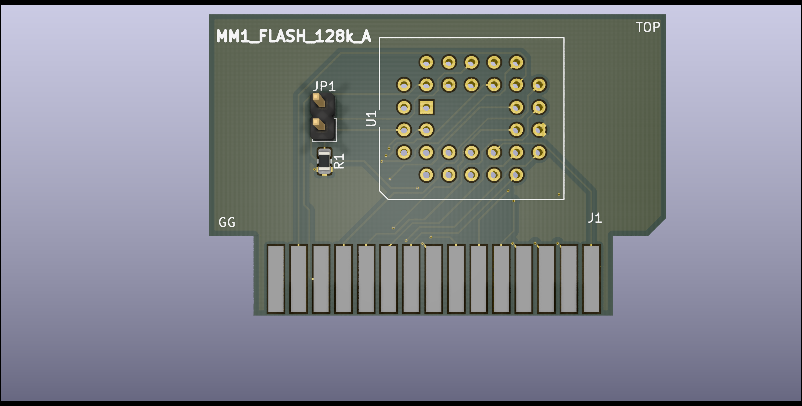
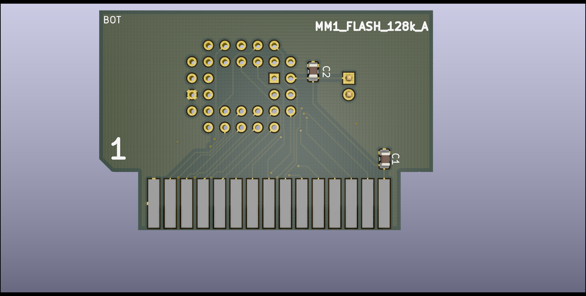

# MM1_FLASH_128k_A

Copyright (C) 2020 Guillaume Guillet\
Licensed under CERN-OHL-W v2 or later

<table border="0px">
<tr>
<td>
This source describes Open Hardware and is licensed under the CERN-OHL-W v2 or later.
</td>
</tr>
<tr>
<td>
You may redistribute and modify this documentation and make products
using it under the terms of the CERN-OHL-W v2 (https:/cern.ch/cern-ohl).
This documentation is distributed WITHOUT ANY EXPRESS OR IMPLIED
WARRANTY, INCLUDING OF MERCHANTABILITY, SATISFACTORY QUALITY
AND FITNESS FOR A PARTICULAR PURPOSE. Please see the CERN-OHL-W v2
for applicable conditions.
</td>
</tr>
</table>

Made with [Kicad](https://kicad-pcb.org/)

## Description
A FLASH card with 128kBytes of capacity and compatible with [MM1 standard](https://github.com/JonathSpirit/GComputer_standard).

 

## Status

Version :
> MM1_FLASH_128k_A revision 1

Status :
> Not tested !

Known issues :
> (Empty)
